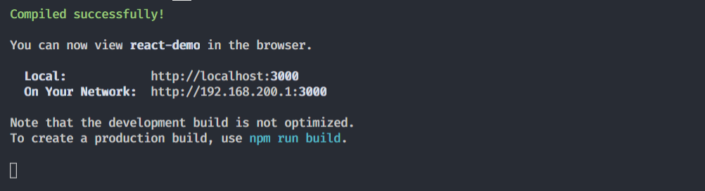

## React 快速上手

### 开始

1. 开始一个`React`的项目.

```shell
npx create-react-app my-app
```

> 注意：`Node >= 8.10` 和 `npm >= 5.6`,`npx`是 [npm 5.2+ 附带的 package 运行工具](https://medium.com/@maybekatz/introducing-npx-an-npm-package-runner-55f7d4bd282b)。

参数说明： 

`my-app`: 指的是项目路径，比如想在当前目录创建项目，则`npx create-react-app .` 

过程可能会久一点,安装完之后,你会发现`git`已经是创建好的.`npm start`测试安装是否成功:



如果有以上信息,则成功,默认端口号是`3000`,按照提示我们访问,[http://localhost:3000](http://localhost:3000 ),一般会自动访问.

2. 从 `hello world`开始.

程序主入口是`src/index.js`.

```react
import React from 'react';
import ReactDOM from 'react-dom';
import './index.css';
import App from './App';
import * as serviceWorker from './serviceWorker';

ReactDOM.render(<App />, document.getElementById('root'));

// If you want your app to work offline and load faster, you can change
// unregister() to register() below. Note this comes with some pitfalls.
// Learn more about service workers: https://bit.ly/CRA-PWA
serviceWorker.unregister();
```

其中关键的是, `ReactDOM.render();`以上含义是将`APP`组件挂载到`root`上.那么这个`root`,又是哪里的.

到`public\index.html`文件下有:

```html
  <body>
    <noscript>You need to enable JavaScript to run this app.</noscript>
    <div id="root"></div>
  </body>
```

发现在该`html`文件下, `<div id="root"></div>`, 所以其实是让该组件挂载到该组件下.

所以我们可以修改挂载的内容.

```react
ReactDOM.render(<h2>hello world</h2>, document.getElementById('root'));
```

再次运行应该就能看到 `hello world`, 访问[http://localhost:3000](http://localhost:3000 ).

### 了解`JSX`

它是一个 JavaScript 的语法扩展.它跟模板语言有点类似, 作用当然是让视图与数据进行分离, 从而使得组件进行复用.`JSX `可以生成 `React` “元素”.

示例: 对于刚才的 `hello world`,我们就可以利用.

```react
const name = 'Veng';
const element = <h2>hello ,{name}</h2>;
ReactDOM.render(element, document.getElementById('root'));
```

这样就可以对视图和数据及进行分离, 可以动态的生成视图,变量用花括号`{}`括起来,并且这样模式是防注入攻击的, 就算是用户输入, 它会将输入内容转化为字符串解析.

实际上, 最好的做法是将组件单独成一个模块,然后再导入,跟之前原始的`<App/>` 一样.

>**注意**:
>
>要使用JSX,必须导入React才能够用.`import React from 'react';`

### 元素渲染

什么是元素, 就像刚刚的 `const element = <h2>hello ,{name}</h2>;`就是元素.与浏览器的 DOM 元素不同，React 元素是创建开销极小的普通对象。React DOM 会负责更新 DOM 来与 React 元素保持一致。

>**注意：**
>
>你可能会将元素与另一个被熟知的概念——“组件”混淆起来。组件是由元素构成的。

#### 更新已渲染的元素.

React 元素是不可变对象。一旦被创建，你就无法更改它的子元素或者属性。一个元素就像电影的单帧：它代表了某个特定时刻的 UI。

根据我们已有的知识，更新 UI 唯一的方式是创建一个全新的元素，并将其传入 `ReactDOM.render()`。

示例: 时间显示器

```react
function tick() {
  const element = (
    <div>
      <h2>it is {new Date().toLocaleString()}</h2>
    </div>);
  ReactDOM.render(element, document.getElementById('root'));
}
setInterval(tick, 1000);
```

这个例子会在 [`setInterval()`](https://developer.mozilla.org/en-US/docs/Web/API/WindowTimers/setInterval) 回调函数，每秒都调用 `ReactDOM.render()`.

>在实践中，大多数 React 应用只会调用一次 `ReactDOM.render()`.

上面的例子中, 虽然我们对整个页面进行更新,但是实际上`React`只进行了局部更新.`React DOM `会将元素和它的子元素与它们之前的状态进行比较，并只会进行必要的更新来使 `DOM` 达到预期的状态。

为了验证渲染的部分,可以观察 `DOM`结构:


但是实际上, 我们需要的并不是`UI`随时间的变化而变化, 而是在在任意时刻给定状态. 由此就有了组件.

### 组件 props

组件，从概念上类似于 JavaScript 函数。它接受任意的入参（即 “props”），并返回用于描述页面展示内容的 React 元素。

#### 定义组件

1. 开始定义第一个组件`src/components/Welcome.js`,有两种方式创建组件一种是通过函数,一种是通过`class`.

```react
import React from 'react';

function Welcome(props) {
  return (<h2>hello,{props.name}</h2>);
}

export default Welcome;
```

```react
import React from 'react';

class Welcome extends React.Component{
  render(){
    return <h2>hello,{this.props.name}</h2>;
  }
}

export default Welcome;
```

每次组件更新时 `render` 方法都会被调用.

2. `src/index.js`,引入组件,并导入数据.

```react
import Welcome from './components/Welcome';

ReactDOM.render(<Welcome name="Veng"/>, document.getElementById('root'));
```

#### 复用组件

从组件的构成可以看出,各自组件的数据是互不影响的.

```react
function App() {
  return (
    <div>
      <Welcome name="A" />
      <Welcome name="B" />
      <Welcome name="C" />
    </div>
  );
}
```

> 通常来说，每个新的 React 应用程序的顶层组件都是 `App` 组件。但是，如果你将 React 集成到现有的应用程序中，你可能需要使用像 `Button` 这样的小组件，并自下而上地将这类组件逐步应用到视图层的每一处。

总得来说,就是组件的复用程度越高越好,这样也就更加的灵活.

>组件无论是使用[函数声明还是通过 class 声明](https://react.docschina.org/docs/components-and-props.html#function-and-class-components)，都决不能修改自身的 props

那么为什么自身的`props`不能被修改? 因为如果出现这样情况,子组件的`props`是来自父组件,那么如果自组件的`props`值改变了,父组件也会改变.实际上,我们不能让这种情况发生.故而有了一个保存组件状态值的一个参数`state`,`props`仅仅用来初始化,`state`用来保存组件的状态,往子组件传递数据时用的是`state`,子组件用`props`接收,用自身得`state`保存状态,这样子递归,每个组件的状态`state`都是私有得.

### State 和 生命周期

之前的时间显示,是每次都需要`Render`,我们希望,编写一次代码,便可以让时间组件自我更新:

```react
ReactDOM.render(
  <Clock />,
  document.getElementById('root')
);
```

我们需要在 `Clock` 组件中添加 “state” 来实现这个功能。

State 与 props 类似，但是 state 是私有的，并且完全受控于当前组件。

1. 先将时间信息放在`state`里.

```react
import React from 'react';

class Clock extends React.Component {
  constructor(props) {
    super(props);
    this.state = { date: new Date() };
  }
  render() {
    return (
      <div>
        <h2>it is {this.state.date.toLocaleString()}</h2>
      </div>
    );
  }
}

export default Clock;
```

`constructor`是构造器,初始化状态.

这样子写了之后,时间并没自动更新,所以怎么让`state.date`更新? 同样得,我们可以设置一个计时器来进行对其更新.

那么计时器在哪里设置. 组件提供了第一次渲染时的函数`componentDidMount`,在`React`称之为`挂载 mount`,还有组件被删除时的函数`componentWillUnmount`,在`React`称之为`卸载 unmount`.

```react
import React from "react";

class Clock extends React.Component {
  constructor(props) {
    super(props);
    this.state = { date: new Date() };
  }
  componentDidMount() {
    this.timerId = setInterval(() => {
      this.setState({
        date: new Date()
      });
    }, 1000);
  }
  componentWillUnmount() {
    clearInterval(this.timerId);
  }
  render() {
    return (
      <div>
        <h2>it is {this.state.date.toLocaleString()}</h2>
      </div>
    );
  }
}

export default Clock;

```
快速概括一下发生了什么和这些方法的调用顺序：
>1. 当 `<Clock />` 被传给 `ReactDOM.render()`的时候，React 会调用 `Clock` 组件的构造函数。因为 `Clock` 需要显示当前的时间，所以它会用一个包含当前时间的对象来初始化 `this.state`。我们会在之后更新 state。
>2. 之后 React 会调用组件的 `render()` 方法。这就是 React 确定该在页面上展示什么的方式。然后 React 更新 DOM 来匹配 `Clock` 渲染的输出。
>3. 当 `Clock` 的输出被插入到 DOM 中后，React 就会调用 `ComponentDidMount()` 生命周期方法。在这个方法中，`Clock` 组件向浏览器请求设置一个计时器来每秒调用`setState()`。
>4. `Clock` 组件会通过调用 `setState()` 来计划进行一次 UI 更新。得益于 `setState()` 的调用，React 能够知道 state 已经改变了，然后会重新调用 `render()` 方法来确定页面上该显示什么。这一次，`render()` 方法中的 `this.state.date` 就不一样了，如此以来就会渲染输出更新过的时间。React 也会相应的更新 DOM。
>5. 一旦 `Clock` 组件从 DOM 中被移除，React 就会调用 `componentWillUnmount()` 生命周期方法，这样计时器就停止了

关于 `setState()`:

为什么不直接修改:`this.state.date=new Date()`? 代码没问题,但是这样子修改并不会通知组件,`state` 变了,所以构造函数是唯一可以给`this.state`赋值的地方.

>出于性能考虑，React 可能会把多个 `setState()` 调用合并成一个调用。
>
>因为 `this.props` 和 `this.state` 可能会异步更新，所以你不要依赖他们的值来更新下一个状态。

例如，此代码可能会无法更新计数器：

```react
// Wrong
this.setState({
  counter: this.state.counter + this.props.increment,
});
```

可能当前组件的通知排在前面,而后面又改变了,但是排在了后面.

要解决这个问题,可以让`setState()`接收一个函数而不是一个对象,这样渲染得时候保存是一个函数,就会回调.

```react
// Correct
this.setState((state, props) => ({
  counter: state.counter + props.increment
}));
```

state 的存在,数据是自上往下流动的.

> 这个函数用上一个 state 作为第一个参数，将此次更新被应用时的 props 做为第二个参数,顺序记住.

### 事件处理

React 元素的事件处理和 DOM 元素的很相似，但是有一点语法上的不同:

- React 事件的命名采用小驼峰式（camelCase），而不是纯小写。
- 使用 JSX 语法时你需要传入一个函数作为事件处理函数，而不是一个字符串。

示例:

传统dom

```html
<button onclick="activateLasers()">
  Activate Lasers
</button>
```

react:

```react
<button onClick={activateLasers}>
  Activate Lasers
</button>
```

> 在 React 中另一个不同点是你不能通过返回 `false` 的方式阻止默认行为。你必须显式的使用 `preventDefault`.

示例:

传统的 HTML 中阻止链接默认打开一个新页面，你可以这样写：

```html
<a href="#" onclick="console.log('The link was clicked.'); return false">
  Click me
</a>
```

React 中，可能是这样的：

```react
function ActionLink() {
function handleClick(e) {
    e.preventDefault();
    console.log('The link was clicked.');
  }

  return (
    <a href="#" onClick={handleClick}>
      Click me
    </a>
  );
}
```

这样`a`标签的默认点击事件不会触发,页面不会跳转,这就是`preventDefault`的作用.

在这里，`e` 是一个合成事件。React 根据 [W3C 规范](https://www.w3.org/TR/DOM-Level-3-Events/)来定义这些合成事件，所以你不需要担心跨浏览器的兼容性问题。

使用 React 时，你一般不需要使用 `addEventListener` 为已创建的 DOM 元素添加监听器。事实上，你只需要在该元素初始渲染的时候添加监听器即可。

当你使用 [ES6 class](https://developer.mozilla.org/en/docs/Web/JavaScript/Reference/Classes) 语法定义一个组件的时候，通常的做法是将事件处理函数声明为 class 中的方法.

```REACT
import React from 'react';

class Toggle extends React.Component {
  constructor(props) {
    super(props);
    this.state = { isToggle: true };

    this.handleToggleClick = this.handleToggleClick.bind(this);
  }

  handleToggleClick() {
    this.setState(state => ({
      isToggle: !state.isToggle,
    }));
  }

  render() {
    return (
      <div>
        <button onClick={this.handleToggleClick}>
          {this.state.isToggle ? 'ON' : 'OFF'}
        </button>
      </div>
    );
  }
}

export default Toggle;
```

其中的处理点击事件的方法,我们在初始化的时候给其绑定了this`this.handleToggleClick = this.handleToggleClick.bind(this);`,使得函数里的`this`指向组件,否则函数里的`this`是```undefined`,你必须谨慎对待 JSX 回调函数中的 `this`,在 JavaScript 中，class 的方法默认不会绑定`this`。

如果你觉得`bind`这样麻烦,我们可以利用箭头函数.

```react
  handleToggleClick = () => {
    this.setState(state => ({
      isToggle: !state.isToggle,
    }));
  }
```

这样就不用`bind`了,这里的`this`会指向组件.

亦或者:

```react
  render() {
    return (
      <div>
        <button onClick={e=>this.handleToggleClick(e)}>
          {this.state.isToggle ? 'ON' : 'OFF'}
        </button>
      </div>
    );
  }
```

这样也是可行的,不过以上推荐第二种.

### 条件渲染

在 React 中，你可以创建不同的组件来封装各种你需要的行为。然后，依据应用的不同状态，你可以只渲染对应状态下的部分内容。

示例:

`src\components\Greeting.js`

```react
import React from 'react';

function GuestGreeting() {
  return <h1>Please sign in!</h1>
}

function UserGreeting() {
  return <h1>Welcome back!</h1>
}

function Greeting(props) {
  const { isLogin } = props;
  return isLogin ? <UserGreeting /> : <GuestGreeting />;
}

export default Greeting;
```

`src\index.js`:

```react
import Greeting from './components/Greeting';

ReactDOM.render(<Greeting isLogin={false} />, document.getElementById('root'));
```

这里组件会根据登录状况来返回不同的问候语.

复杂一点条件: 添加登录登出按钮.

```react
import React from 'react';
import Greeting from './Greeting';

class GreetingWithButton extends React.Component {
  constructor(props) {
    super(props);
    this.state = { isLogin: props.isLogin };
  }
  handleLoginClick = () => {
    this.setState({
      isLogin: true,
    });
  }
  handleLogoutClick = () => {
    this.setState({
      isLogin: false,
    });
  }
  render() {
    const { isLogin } = this.state;
    const button = isLogin ? <button onClick={this.handleLogoutClick}>Logout</button>
      : <button onClick={this.handleLoginClick}>Login</button>
    return (
      <div>
        <Greeting isLogin={this.state.isLogin} />
        {button}
      </div>
    );
  }
}

export default GreetingWithButton;
```

#### 阻止渲染

在极少数情况下，你可能希望能隐藏组件，即使它已经被其他组件渲染。若要完成此操作，你可以让 `render` 方法直接返回 `null`，而不进行任何渲染。

示例:显示隐藏警告!

`src\components\Warning.js`:

```react
import React from 'react';

class Warning extends React.Component {
  render() {
    const { warn } = this.props;
    return warn ? (
      <div className='warning'>
        Warning!
      </div>
    ) : null;
  }
}

export default Warning;
```

`src\components\Page.js`:

```react
import React from 'react';
import Warning from './Warning';

class Page extends React.Component {

  constructor(props) {
    super(props);
    this.state = { showWarning: false };
  }

  handleClick = () => {
    this.setState(state => ({
      showWarning: !state.showWarning
    }));
  }
  render() {
    const showWarning = this.state.showWarning;
    return (
      <div>
        <Warning warn={showWarning} />
        <button onClick={this.handleClick}>{showWarning ? 'Hide' : 'Show'}</button>
      </div>
    );
  }
}

export default Page;
```

`src\index.js`:

```react
import Page from './components/Page';

ReactDOM.render(<Page />, document.getElementById('root'));
```

> 在组件的 `render` 方法中返回 `null` 并不会影响组件的生命周期.

### 列表 和 key

利用`map`函数.

```react
import React from 'react';

class NumberList extends React.Component {

  render() {
    const { numbers } = this.props;
    const listItems = numbers.map(number => {
      return <li>{number}</li>
    });
    return <ul>{listItems}</ul>
  }
}

export default NumberList;
```

将该组件挂载到`root`上面,会发现有一个`warning`:


意思是当你创建一个元素时，必须包括一个特殊的 `key` 属性。

按照它的警告我们为每个元素加上:

```react
const listItems = numbers.map(number => {
	return <li key={number}>{number}</li>
});
```

这样警告消除了.

那么`Key`的作用是什么呢?

#### Key

key 帮助 React 识别哪些元素改变了，比如被添加或删除。因此你应当给数组中的每一个元素赋予一个确定的标识。

一个元素的 key 最好是这个元素在列表中拥有的一个独一无二的字符串。通常，我们使用数据中的 id 来作为元素的 key.

数组元素中使用的 key 在其兄弟节点之间应该是独一无二的。然而，它们不需要是全局唯一的。当我们生成两个不同的数组时，我们可以使用相同的 key 值.

当元素没有确定 id 的时候，万不得已你可以使用元素索引 index 作为 key：

```react
const todoItems = todos.map((todo, index) =>
  // Only do this if items have no stable IDs
  <li key={index}>
    {todo.text}
  </li>
);
```

> 如果列表项目的顺序可能会变化，我们不建议使用索引来用作 key 值，因为这样做会导致性能变差，还可能引起组件状态的问题。
>
> 如果你选择不指定显式的 key 值，那么 React 将默认使用索引用作为列表项目的 key 值。

<font color='#dd001b'>元素的 key 只有放在就近的数组上下文中才有意义。</font>

示例:

```react
function ListItem(props) {
  // 正确！这里不需要指定 key：
  return <li>{props.value}</li>;
}

function NumberList(props) {
  const numbers = props.numbers;
  const listItems = numbers.map((number) =>
    // 正确！key 应该在数组的上下文中被指定
    <ListItem key={number.toString()}
              value={number} />
  );
  return (
    <ul>
      {listItems}
    </ul>
  );
}
```

这里的`key`是放在`ListItem`上而不是`li`上,因为就近数组的上下文在`ListItem`这里.

> 一个好的经验法则是：在 `map()` 方法中的元素需要设置 key 属性。

还有就是对于key属性,它不会传值给组件.

```react
const content = posts.map((post) =>
  <Post
    key={post.id}
    id={post.id}
    title={post.title} />
);
```

`Post`组件的`props`读不到`key`,但是可以读取到`props.id `和`props.title`.

### 表单

在 React 里，HTML 表单元素的工作方式和其他的 DOM 元素有些不同，这是因为表单元素通常会保持一些内部的 state。

在 HTML 中，表单元素（如`<input>`、 `<textarea>` 和 `<select>`）之类的表单元素通常自己维护 state，并根据用户输入进行更新。而在 React 中，可变状态（mutable state）通常保存在组件的 state 属性中，并且只能通过使用 [`setState()`](https://react.docschina.org/docs/react-component.html#setstate)来更新。我们可以把两者结合起来，使 React 的 state 成为“唯一数据源”。渲染表单的 React 组件还控制着用户输入过程中表单发生的操作。被 React 以这种方式控制取值的表单输入元素就叫做“**受控组件**”。

示例:

```react
import React from 'react';

class NameForm extends React.Component {
  constructor(props) {
    super(props);
    this.state = { value: '' };
  }

  handleChange = (e) => {
    this.setState({
      value: e.target.value,
    });
  }

  handleSubmit = (e) => {
    console.log(this.state.value);
    e.preventDefault();
  }

  render() {
    return (
      <form onSubmit={this.handleSubmit}>
        <input value={this.state.value} onChange={this.handleChange} />
        <input type='submit' value='提交' />
      </form>
    );
  }
}

export default NameForm;
```


以上将`input`的值绑定在了该组件的`state`.

#### 处理多个输入

```react
import React from 'react';

class Reservation extends React.Component {
  constructor(props) {
    super(props);
    this.state = {
      isGoing: true,
      numberOfGuests: 2
    };
  }

  handleInputChange = (event) => {
    const target = event.target;
    const value = target.type === 'checkbox' ? target.checked : target.value;
    const name = target.name;

    this.setState({
      [name]: value
    });
  }

  render() {
    return (
      <form>
        <label>
          参与:
          <input
            name="isGoing"
            type="checkbox"
            checked={this.state.isGoing}
            onChange={this.handleInputChange} />
        </label>
        <br />
        <label>
          来宾人数:
          <input
            name="numberOfGuests"
            type="number"
            value={this.state.numberOfGuests}
            onChange={this.handleInputChange} />
        </label>
      </form>
    );
  }
}

export default Reservation;
```


这个例子中,两个`input`绑定的同一个函数,函数中通过`name`来获悉是哪个组件,并且`name`与`state`里的属性名相同.

### 状态的提升

现在是有这么个需求,有两个输入框,一个输入框是摄氏度,一个是华氏度,只要输入的温度,两个框会自动同步转换,也就是兄弟组件之间怎么传递数据的问题.

先写温度输入框组件:

```react
const scaleNames = {
  c: 'Celsius',
  f: 'Fahrenheit'
};

class TemperatureInput extends React.Component {
  constructor(props) {
    super(props);
    this.handleChange = this.handleChange.bind(this);
    this.state = {temperature: ''};
  }

  handleChange(e) {
    this.setState({temperature: e.target.value});
  }

  render() {
    const temperature = this.state.temperature;
    const scale = this.props.scale;
    return (
      <fieldset>
        <legend>Enter temperature in {scaleNames[scale]}:</legend>
        <input value={temperature}
               onChange={this.handleChange} />
      </fieldset>
    );
  }
}
```

父组件:

```react
class Calculator extends React.Component {
  render() {
    return (
      <div>
        <TemperatureInput scale="c" />
        <TemperatureInput scale="f" />
      </div>
    );
  }
}
```

但是有一个问题,两个温度输入框的温度都保存在自己的`state`里,两者怎么进行数据的交互?

解决方案是,将温度的接收提升到父组件,也就是说温度输入框的数据,是由父组件传递过来的`props`决定.

温度输入框组件修改为:

```react
class TemperatureInput extends React.Component {
  constructor(props) {
    super(props);
    this.handleChange = this.handleChange.bind(this);
  }

  handleChange(e) {
    this.props.onTemperatureChange(e.target.value);
  }

  render() {
    const temperature = this.props.temperature;
    const scale = this.props.scale;
    return (
      <fieldset>
        <legend>Enter temperature in {scaleNames[scale]}:</legend>
        <input value={temperature}
               onChange={this.handleChange} />
      </fieldset>
    );
  }
}
```

现在输入框的数据由父组件传入所决定,并且`onChange`绑定调用的是有父组件传递的函数.

父组件修改为:

```react
// 温度转换的函数
function toCelsius(fahrenheit) {
  return (fahrenheit - 32) * 5 / 9;
}

function toFahrenheit(celsius) {
  return (celsius * 9 / 5) + 32;
}
function tryConvert(temperature, convert) {
  const input = parseFloat(temperature);
  if (Number.isNaN(input)) {
    return '';
  }
  const output = convert(input);
  const rounded = Math.round(output * 1000) / 1000;
  return rounded.toString();
}
// 父组件
class Calculator extends React.Component {
  constructor(props) {
    super(props);
    this.handleCelsiusChange = this.handleCelsiusChange.bind(this);
    this.handleFahrenheitChange = this.handleFahrenheitChange.bind(this);
    this.state = {temperature: '', scale: 'c'};
  }

  handleCelsiusChange(temperature) {
    this.setState({scale: 'c', temperature});
  }

  handleFahrenheitChange(temperature) {
    this.setState({scale: 'f', temperature});
  }

  render() {
    const scale = this.state.scale;
    const temperature = this.state.temperature;
    const celsius = scale === 'f' ? tryConvert(temperature, toCelsius) : temperature;
    const fahrenheit = scale === 'c' ? tryConvert(temperature, toFahrenheit) : temperature;

    return (
      <div>
        <TemperatureInput
          scale="c"
          temperature={celsius}
          onTemperatureChange={this.handleCelsiusChange} />

        <TemperatureInput
          scale="f"
          temperature={fahrenheit}
          onTemperatureChange={this.handleFahrenheitChange} />

      </div>
    );
  }
}
```

两个输入框的值由父组件完全掌控,解决兄弟节点数据问题,可以提升到父组件来解决.

> 在 React 应用中，任何可变数据应当只有一个相对应的唯一“数据源”。通常，state 都是首先添加到需要渲染数据的组件中去。然后，如果其他组件也需要这个 state，那么你可以将它提升至这些组件的最近共同父组件中。你应当依靠[自上而下的数据流](https://react.docschina.org/docs/state-and-lifecycle.html#the-data-flows-down)，而不是尝试在不同组件间同步 state。

### 组合和继承

React 有十分强大的组合模式。我们推荐使用组合而非继承来实现组件间的代码重用。

#### 包含关系

有些组件无法提前知晓它们子组件的具体内容。在 `Sidebar`（侧边栏）和 `Dialog`（对话框）等展现通用容器（box）的组件中特别容易遇到这种情况。

我们建议这些组件使用一个特殊的 `children` prop 来将他们的子组件传递到渲染结果中：

```react
function FancyBorder(props) {
  return (
    <div className={'FancyBorder FancyBorder-' + props.color}>
      {props.children}
    </div>
  );
}
```

这使得别的组件可以通过 JSX 嵌套，将任意组件作为子组件传递给它们。

```react
function WelcomeDialog() {
  return (
    <FancyBorder color="blue">
      <h1 className="Dialog-title">
        Welcome
      </h1>
      <p className="Dialog-message">
        Thank you for visiting our spacecraft!
      </p>
    </FancyBorder>
  );
}
```

`FancyBorder`组件中的内容是通过父组件插进来的,这就是`props.children`的作用,还是十分的实用,实际上我们也能自定义一个属性通过`props`传递,当然没问题,但是有`children`提供了,可以减少代码量.

但是如果碰到需要补充多个部分内容,显然一个`children`只能补充一个地方,所以此时我们可以自定义属性传递.

#### 继承

> 在 Facebook，我们在成百上千个组件中使用 React。我们并没有发现需要使用继承来构建组件层次的情况。
>
> Props 和组合为你提供了清晰而安全地定制组件外观和行为的灵活方式。注意：组件可以接受任意 props，包括基本数据类型，React 元素以及函数。
>
> 如果你想要在组件间复用非 UI 的功能，我们建议将其提取为一个单独的 JavaScript 模块，如函数、对象或者类。组件可以直接引入（import）而无需通过 extend 继承它们。

