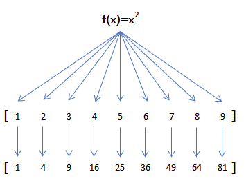

# map/reduce

### map

举例说明，比如我们有一个函数f(x)=x2，要把这个函数作用在一个数组`[1, 2, 3, 4, 5, 6, 7, 8, 9]`上，就可以用`map`实现如下：



由于`map()`方法定义在JavaScript的`Array`中，我们调用`Array`的`map()`方法，传入我们自己的函数，就得到了一个新的`Array`作为结果：

```javascript
function pow(x) {
    return x * x;
}
var arr = [1, 2, 3, 4, 5, 6, 7, 8, 9];
var results = arr.map(pow);  // [1, 4, 9, 16, 25, 36, 49, 64, 81]
```

还能带index：

```javascript
const array = [1,2,3,4];
array.map(function (value, index) {
    console.log(index, value);
});
/*
0 1
1 2
2 3
3 4
*/
```

更可以带上 array本身：

```javascript
array.map(function (value, index, array) {
    console.log(array[index]);
});
/**
1
2
3
4
*/
```

### reduce

再看reduce的用法。Array的`reduce()`把一个函数作用在这个`Array`的`[x1, x2, x3...]`上，这个函数必须接收两个参数，`reduce()`把结果继续和序列的下一个元素做累积计算，其效果就是：

```javascript
[x1, x2, x3, x4].reduce(f) = f(f(f(x1, x2), x3), x4)
```

比方说对一个`Array`求和，就可以用`reduce`实现：

```javascript
var arr = [1, 3, 5, 7, 9];
arr.reduce(function (x, y) {
    return x + y;
}); // 25
```

